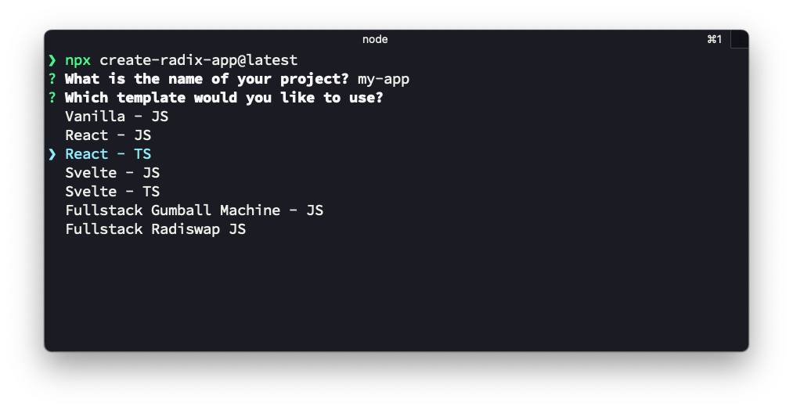
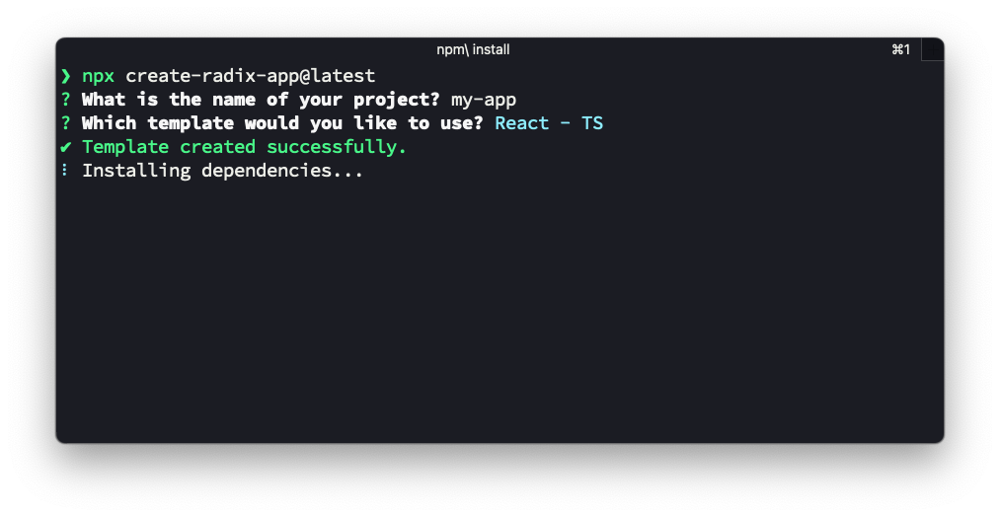
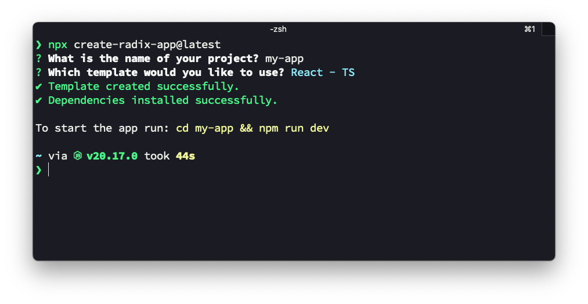
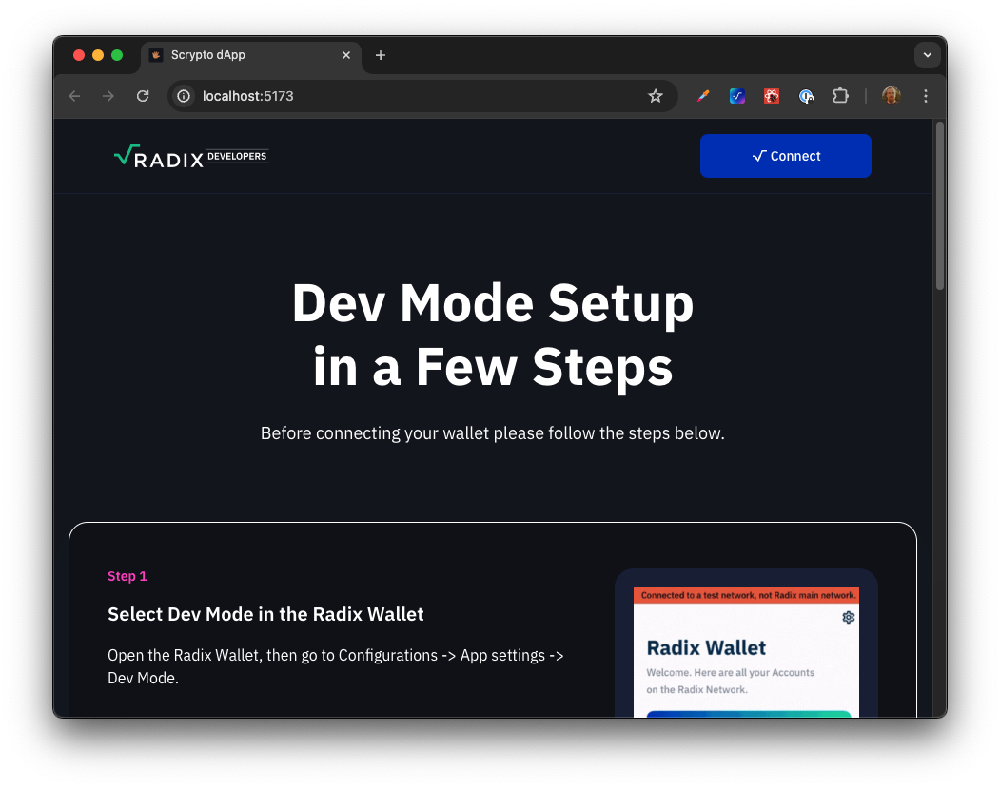

# create-radix-app

A CLI tool to scaffold a new Radix dApp project. Choose from a selection of
templates to get started with your new project.

- Vanilla JS
- React JS
- React TS
- Svelte JS
- Svelte TS
- Full Stack Gumball Machine JS
- Full Stack Radiswap JS

## Getting Started

To scaffold a new project, run the following command in your terminal:

```bash
npx create-radix-app@latest
```

### Name your Project & Choose a Template



### Creating Project & Installing Dependencies




### Start the Development Server


### Open the Project in your Browser



### Start Building your Radix dApp

Check out README.md in your new project for more information on how to get
started building your Radix dApp.

## Contributing

To create a new template for the create-radix-app package, add a new project to
the official-examples repository in the getting-started directory. Add a new
object to the templates array and ensure that the install step is correct for
the new template.

## Testing Locally

Clone this repository and run the following command from the it's root to link
the package to your local NPM registry: `npm link`

You can then run the following command anywhere on your system to test the
application: `npx create-radix-app@latest` and follow the prompts to scaffold a
new dApp project.

Once deployed to NPM there is no need to install the package globally, you can
simply run: `npx create-radix-app@latest` and follow the prompts to scaffold a
new Radix dApp project.

# License

The Create Radix App binaries licensed under the
[Radix Generic EULA](https://www.radixdlt.com/terms/genericEULA).

The Create Radix App code is released under the
[Apache 2.0 license](./LICENSE).

```
Copyright 2023 Radix Publishing Ltd

Licensed under the Apache License, Version 2.0 (the "License"); you may not use this file except in compliance with the License.

You may obtain a copy of the License at: http://www.apache.org/licenses/LICENSE-2.0

Unless required by applicable law or agreed to in writing, software distributed under the License is distributed on an "AS IS" BASIS, WITHOUT WARRANTIES OR CONDITIONS OF ANY KIND, either express or implied.

See the License for the specific language governing permissions and limitations under the License.
```
